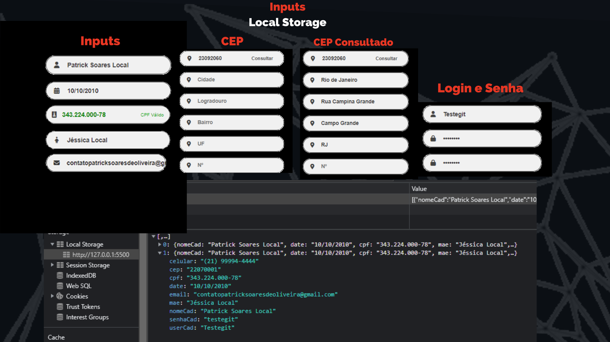

# Tela-de-Autenticacao
 
 <!---Esses são exemplos. Veja https://shields.io para outras pessoas ou para personalizar este conjunto de escudos. Você pode querer incluir dependências, status do projeto e informações de licença aqui--->


> Projeto desenvolvido nas tecnologias: HTML, CSS, JavaScript & Jquery. Com animações e Dark Mode.
> Campos validados em JavaScript, validação do Digito Verificado do CPF, API de CEP, Armazenamento no LocalStorage.

### Ajustes e melhorias

O projeto ainda está em desenvolvimento e as próximas atualizações serão voltadas nas seguintes tarefas:

- [x] Layout e Design
- [x] Responsividade
- [x] Validação em LocalStorage
- [ ] Aperfeiçoamento da validação de campos
- [ ] Finalização do projeto

## 💻 Pré-requisitos

Antes de começar, verifique se você atendeu aos seguintes requisitos:
<!---Estes são apenas requisitos de exemplo. Adicionar, duplicar ou remover conforme necessário--->
* Você instalou a versão mais recente de `<HTML5, CSS3 E JAVASCRIPT>`
* Você tem uma máquina `<Windows / Linux / Mac>`.
* Você leu `<guia / link / documentação_relacionada_ao_projeto>`.

## 🚀 Instalando <Tela-de-Autenticacao>

Para instalar o <Tela-de-Autenticacao>, siga estas etapas:

Linux e macOS:
```
<Entre no repositório do GitHub e baixe o repositório na opção "Download ZIP".

```

Windows:
```
<Entre no repositório do GitHub e baixe o repositório na opção "Download ZIP".
```

## ☕ Usando <Tela-de-Autenticacao>

Para usar <Tela-de-Autenticacao>, siga estas etapas:

```
<O projeto ainda está em descenvolvimento, pode haver erros.>

```

Para a ativação do painel lateral clique no botão de registre-se, ou para a tela de login clique em login.

Alguns campos não são obrigatórios o preenchimento, como: Gênero, Pai e Telefone.

O CPF Aceita apenas CPF's válidos, por conta de um cálculo feito no JavaScript, onde identifica o digito verificador do CPF.

Para a validação começar a ser feita deve se clicar no input e começar a digitação, pois após sera feito a validação.

Os inputs: Nome, Data, CPF, Nome da Mãe, Email, Usuário e Senha estão sendo armazenados no LocalStorage .




```
<Dark Mode>
```


[⬆ Voltar ao topo](#Tela-de-Autenticacao)<br>